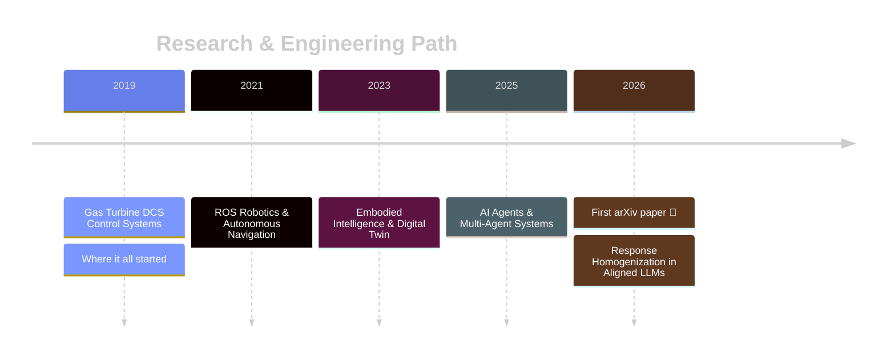

<!-- Header Banner -->


<div align="center">

<!-- Typing Animation -->


<br><br>

<!-- Social & Links -->
[](https://arxiv.org/abs/2603.24124)
[](https://github.com/DigitLion)
[](mailto:liumingyi1993@163.com)

<br>


</div>

---

### 👋 About Me

```yaml
name: Mingyi Liu
location: China
focus: AI Agents · Robotics · LLM Alignment
currently: Independent Researcher
fun_fact: Started in gas turbine DCS, now building agents that think & act
```

I'm an **AI Agent Engineer** and **independent researcher** working at the intersection of embodied intelligence, multi-agent systems, and LLM alignment. My research explores how alignment methods reshape model behavior — and what that means for real-world uncertainty estimation.

---

### 🔬 Latest Research

<table>
<tr>
<td width="72" align="center"><br><br>📄<br><br></td>
<td>

#### [The Alignment Tax: Response Homogenization in Aligned LLMs and Its Implications for Uncertainty Estimation](https://arxiv.org/abs/2603.24124)

*arXiv 2026* · `cs.LG` · `cs.AI` · `cs.CL`

RLHF-aligned LLMs exhibit **response homogenization** — 40–79% of questions collapse to a single semantic cluster, breaking sampling-based uncertainty estimation. **DPO is the cause, not SFT.** Token entropy survives.

<br>

`22 experiments` · `5 benchmarks` · `4 model families` · `3B–14B scale`

<br>

[](https://arxiv.org/abs/2603.24124)
[](https://github.com/DigitLion/ucbd-experiment)

</td>
</tr>
</table>

<details>
<summary><b>📚 Cite this work (BibTeX)</b></summary>

```bibtex
@article{liu2026alignmenttax,
  title={The Alignment Tax: Response Homogenization in Aligned LLMs
         and Its Implications for Uncertainty Estimation},
  author={Liu, Mingyi},
  journal={arXiv preprint arXiv:2603.24124},
  year={2026}
}
```

</details>

---

### 🛠️ Tech Stack

<div align="center">


<br><br>


</div>

---

### 💻 Featured Projects

<div align="center">

<a href="https://github.com/DigitLion/ucbd-experiment">

</a>
<a href="https://github.com/DigitLion/Fast-Drone-250-450">

</a>

</div>

---

### 📊 GitHub Analytics

<div align="center">


<br>


</div>

---

### 🚀 Journey



---

<!-- Footer Banner -->


<div align="center">

*"The only way to do great work is to love what you do."* — Steve Jobs

<br><br>

[](https://arxiv.org/abs/2603.24124)
[](https://github.com/DigitLion)
[](mailto:liumingyi1993@163.com)

</div>
